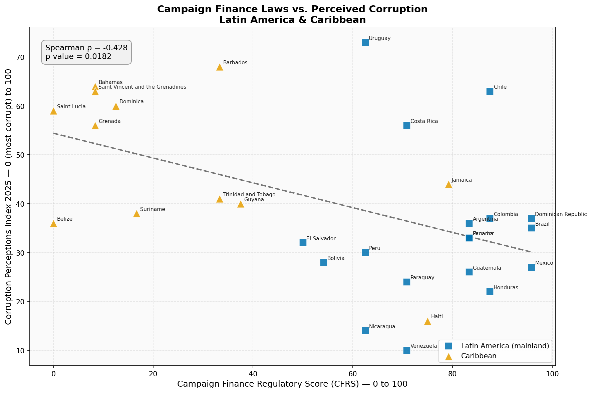

# Campaign Finance Regulatory Score (CFRS) — Latin America & Caribbean

> **Do stronger campaign finance laws actually reduce corruption?**
> This project builds an original index scoring illicit campaign financing laws across 32 Latin American and Caribbean countries, then tests whether stronger laws correlate with lower perceived corruption.

**🔗 Live site:** https://angelloaleon.github.io/campaign-finance-latam/

---

## Key Finding

**Spearman ρ = -0.428 (p = 0.018)** — statistically significant at the 95% confidence level.

Countries with more campaign finance laws on the books tend to *score lower* on the Corruption Perceptions Index. Rather than a paradox, this reflects **reactive legislation**: highly corrupt countries are more likely to have passed reform laws in response to public pressure. Meanwhile, Caribbean small island states score well on CPI despite minimal regulation, likely due to simpler political economies.



---

## Robustness

The headline correlation depends on two analytical choices — how the 12 variables are
weighted, and how "No data" responses are scored. Recomputing the correlation under
reasonable alternatives shows the finding is stable:

| Method | Spearman ρ | p-value | n |
|---|---|---|---|
| Baseline (equal-variable weighting, no-data = 0) | -0.428 | 0.018 | 30 |
| Pillar-weighted (each of 4 pillars = 25%) | -0.428 | 0.018 | 30 |
| No-data dropped (excluded, not zeroed) | -0.434 | 0.017 | 30 |

The negative relationship holds across all three specifications and remains significant
at the 95% level, indicating it is not an artifact of the weighting scheme or the
treatment of missing data. Full computation is in the analysis notebook (§3b).

---

## Data Sources

| Dataset | Source | Year |
|---|---|---|
| Political Finance Database | [International IDEA](https://www.idea.int/data-tools/data/political-finance-database) | 2023 |
| Corruption Perceptions Index | [Transparency International](https://www.transparency.org/en/cpi) | 2025 |

---

## Methodology

### The CFRS Index
Each country is scored across **12 variables** grouped into **4 pillars**:

| Pillar | Variables |
|---|---|
| **A — Prohibitions** | Foreign donation ban, anonymous donation ban, corporate donation ban, banking system requirement |
| **B — Spending Limits** | Candidate spending limit, party spending limit |
| **C — Transparency** | Donor disclosure, expenditure disclosure, election reporting, regular reporting |
| **D — Enforcement** | Independent oversight body, sanctions for violations |

Each variable is scored 0, 0.5, or 1 based on IDEA's responses. The final CFRS is the average across all 12 variables, scaled to 0–100.

**Note on weighting:** because the index averages all 12 variables equally, the pillars are *not* weighted equally — Prohibitions and Transparency (4 variables each) carry twice the weight of Spending Limits and Enforcement (2 variables each). This is a deliberate choice reflecting variable availability in the IDEA data; a pillar-weighted version is reported in the [Robustness](#robustness) section above.

### Correlation
Spearman rank correlation was chosen over Pearson because the data is ordinal and a strictly linear relationship is not assumed.

---

## SQL Analysis

The same data is also queryable in SQL. `load_db.py` loads the CSVs into an
in-memory SQLite database and runs `queries.sql`, which includes:

- an **inner join** of CFRS and CPI on ISO3 (the 30-country analysis set)
- a **tiered ranking** of regulatory strength using `CASE`
- **regional pillar averages**, which show the region is strongest on
  Transparency (65) and Enforcement (61) but weakest on Spending Limits (42)

Run it with `python load_db.py`.

---

## Project Structure

```
campaign-finance-latam/
├── data/
│   ├── raw/
│   │   ├── export_table_raw.csv        # IDEA Political Finance Database export
│   │   └── CPI2025_Results.csv         # Transparency International CPI 2025
│   └── processed/
│       └── cfrs_scores.csv             # CFRS scores for 32 countries
├── notebooks/
│   └── 01_cfrs_analysis.ipynb          # Full analysis notebook
├── outputs/
│   └── cfrs_vs_cpi.png                 # Scatter plot
├── build_cfrs.py                       # Scoring script
├── queries.sql                         # SQL analysis queries
├── load_db.py                          # Loads CSVs into SQLite and runs queries
├── index.html                          # GitHub Pages site
├── requirements.txt                    # Python dependencies
└── README.md
```

---

## Reproducing the Analysis

```bash
pip install -r requirements.txt
python build_cfrs.py     # compute CFRS scores
python load_db.py        # run the SQL analysis
```

`build_cfrs.py` reads the raw IDEA export, computes CFRS scores for all 32 countries, and writes `data/processed/cfrs_scores.csv`. The full statistical analysis and visualization are in `notebooks/01_cfrs_analysis.ipynb`.

---

## Results Summary

| Tier | Countries | CFRS Score |
|---|---|---|
| Strong framework | Brazil, Dominican Republic, Mexico | 95+ |
| Good framework | Colombia, Honduras, Chile, Ecuador, Guatemala, Argentina, Panama | 83–88 |
| Partial framework | Jamaica, Haiti, Costa Rica, Venezuela, Paraguay, Uruguay, Peru, Nicaragua | 62–79 |
| Weak/no framework | Bolivia, El Salvador, Guyana, Barbados, Trinidad & Tobago, Suriname, Caribbean islands | 0–54 |

---

## Limitations

- CPI measures *perceptions* of corruption, not actual corruption
- IDEA data reflects laws on paper — enforcement quality is not captured
- The correlation is based on 30 countries (32 are scored on the CFRS, but Antigua & Barbuda and Saint Kitts & Nevis are dropped for lack of matching CPI data), which limits statistical power
- The index involves choices about variable weighting and missing-data treatment; a robustness check (above) confirms the main finding is stable across reasonable alternatives

---

## So What? — What This Shows and Where It Goes Next

This project is a descriptive analysis, not a causal one, and it's deliberately
cautious about what a cross-country correlation can claim. The headline result
(that more campaign finance regulation tracks *higher* perceived corruption)
confirmed a suspicion I had going in: that legislation in this region is often
**reactive**. Countries pass reform laws in response to corruption scandals and
public pressure, so the presence of strong laws can be a marker of a corruption
problem rather than evidence it's been solved. The practical lesson is that a high
regulatory score should prompt the question *"is this enforced, and did it change
anything?"* rather than reassurance.

It also reinforced a limit of this kind of index: a regional aggregate flattens
real differences between countries that share little beyond geography. A meaningful
read of any single country needs more than its score.

**Where I'd take this next:**

- **Add enforcement data** — prosecutions, audit outcomes, or sanctions actually
  applied — to test whether laws *plus* enforcement track cleaner outcomes where
  laws alone do not.
- **Bring in qualitative and sentiment data** to capture what a 0–100 score can't:
  how reform is actually perceived and experienced on the ground.
- **Go country-specific, not just regional** — individual assessments would draw on
  each country's legislative history and the existing literature, since context
  varies sharply even within the region.
- **Track change over time** rather than a single 2025 snapshot, to see whether
  reforms eventually move the perception needle.

 --- 

## Author

**Angello Leon**
Built as a portfolio project demonstrating data collection, original index construction, statistical analysis, and policy research skills.
